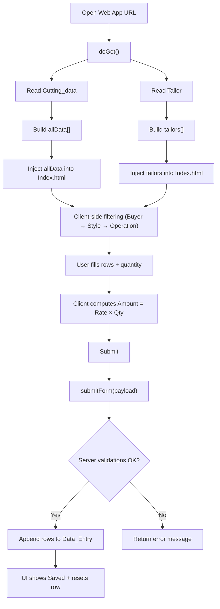
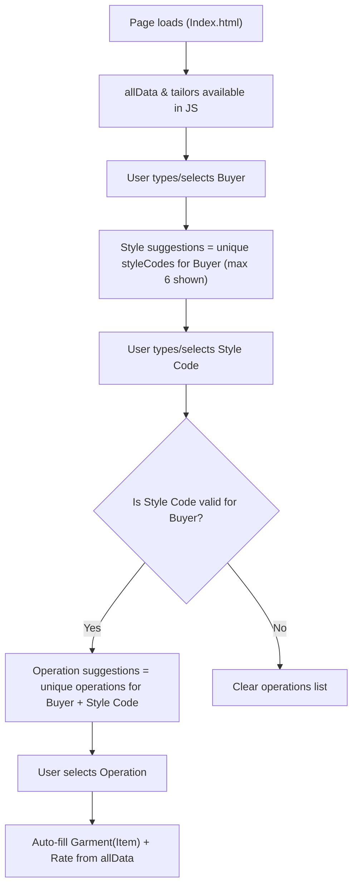
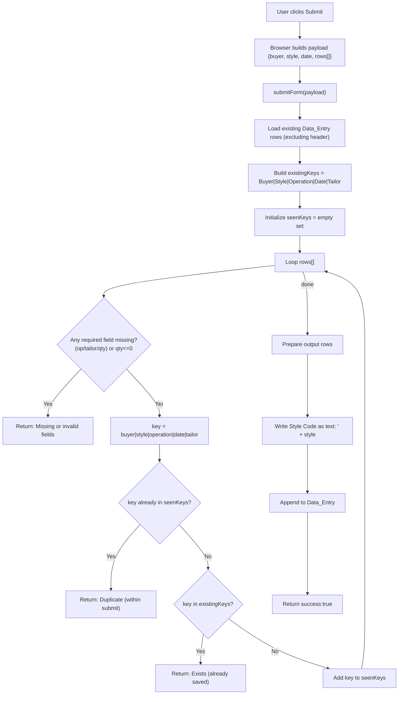

Below is a **GitHub README-ready** document tailored **exactly** to the `Code.gs` and `Index.html` you pasted (including: preloaded `allData/tailors`, client-side filtering, server-side duplicate checks, and forcing Style Code as text on write).

---

# Piece Rate Tailor Form (Google Apps Script Web App)

A Google Apps Script + HTML web app to capture **piece rate** tailoring/production entries.

The app reads master data from:

* **`Cutting_data`** (Buyer, Style Code, Operations, Item, Rate)
* **`Tailor`** (Tailor names)

…and writes validated records into:

* **`Data_Entry`**

This version is optimized for low latency by **preloading all required master data once in `doGet()`** and performing all dropdown filtering **client-side**.

---

## 1) What It Does

✅ **Header filters:**

* Buyer (searchable)
* Style Code (searchable, max 6 suggestions)
* Date (prefilled with today, editable)

✅ **Row entry table:**

* Operation (filtered by Buyer + Style Code, searchable)
* Garment auto-filled (from `Item`)
* Rate auto-filled
* Tailor dropdown (from `Tailor` sheet)
* Quantity input
* Amount auto-calculated (Rate × Qty)

✅ **Submit behavior:**

* Validates required fields
* Prevents duplicates (same Buyer + Style Code + Operation + Date + Tailor)
* Appends rows to `Data_Entry`
* Forces **Style Code saved as TEXT** in Google Sheets

---

## 2) Sheet Schema Requirements

### A) `Cutting_data` (master / reference)

**Required headers (exact match):**

* `Buyer`
* `Style Code`
* `Operation`
* `Item`
* `Rate`

> Your sheet may contain other columns (e.g., Style ID, DPR Cut Qty, etc.), but the app only uses the headers above.

Example row:

| Buyer  | Style Code | Operation | Item            | Rate |
| ------ | ---------: | --------- | --------------- | ---: |
| Frendz |      40248 | btn plk   | Boyes H/S Shirt | 0.85 |

**Important note:**
Even if `Style Code` appears numeric (40248), it is cast to a **string** in `doGet()` so matching works reliably.

---

### B) `Tailor`

**Required header:**

* `Tailor`

---

### C) `Data_Entry` (output)

**Headers must be in this order:**

1. Buyer
2. Style Code
3. Garment
4. Operation
5. Rate
6. Date
7. Tailor
8. Quantity
9. Amount

---

## 3) System Architecture

### Backend: `Code.gs`

* Reads master data from sheets
* Injects `allData` + `tailors` into `Index.html`
* Validates and writes data on submit

### Frontend: `Index.html`

* Renders form UI
* Filters dropdowns locally using injected data
* Calculates amount instantly
* Sends payload to backend via `google.script.run.submitForm(...)`

---

## 4) Data Flow (High-level Flowchart)
That error happens because GitHub’s Mermaid parser is strict: in your diagram block, some nodes ended up on the **same line** (or with hidden characters), so Mermaid reads it as one long statement and fails.

Use the corrected Mermaid blocks below (they render on GitHub). I’m also including a **Submit/Validation flowchart** that’s useful for README.

---

## ✅ High-level App Flow (GitHub-safe Mermaid)



---

## ✅ Buyer → Style Code → Operation Filtering Flow (Client-side)



---

## ✅ Submit + Server-side Validation Flow (submitForm)



---


---

## 5) Core Logic and Structure

### 5.1 Backend Logic (`Code.gs`)

#### `getColIndex(sheet, header)`

* Finds the header in row 1
* Returns 1-based column index
* Throws an error if header missing

#### `doGet()`

**Purpose:** preload everything needed to avoid latency.

Steps:

1. Reads full `Cutting_data`
2. Locates indices for:

   * Buyer, Style Code, Operation, Item, Rate
3. Builds `allData` like:

```js
{
  buyer: "Frendz",
  styleCode: "40248",
  operation: "btn plk",
  garment: "Boyes H/S Shirt",
  rate: 0.85
}
```

4. Reads Tailor list from `Tailor` sheet and deduplicates it
5. Injects both arrays into `Index.html` template:

```html
const allData = <?!= JSON.stringify(allData) ?>;
const tailors = <?!= JSON.stringify(tailors) ?>;
```

✅ This makes filtering instant because everything is already in the browser.

---

#### RPC Functions (compatibility)

These exist even though UI is client-side:

* `getBuyers()`
* `getStyles(buyer)`
* `getOperations(styleCode, buyer)`
* `getTailors()`
* `getOperationDetails(op)`

> Useful if you later revert to server-side dropdown population, debugging, or building other endpoints.

---

#### `submitForm({ buyer, style, date, rows })`

**Server-side checks and insertion**

**Duplicate Key Definition**
A record is considered duplicate if same:

* Buyer
* Style Code
* Operation
* Date
* Tailor

Key format:

```js
[b, s, op, dt, tl].join('|')
```

**Validations**
For each row:

* operation must exist
* tailor must exist
* quantity must exist and > 0
* prevent duplicates:

  * inside same submission (`seen` Set)
  * against existing Data_Entry rows (`existing` Array)

**Ensures Style Code is stored as TEXT**
When writing to sheet:

```js
"'" + style
```

Sheets hides `'` visually but stores value as text.

**Output Row Order**

```js
[ buyer, "'"+style, garment, operation, rate, date, tailor, qty, amount ]
```

---

### 5.2 Frontend Logic (`Index.html`)

#### Preloaded datasets

* `allData` and `tailors` are embedded directly on load
* No `google.script.run` calls for Buyer/style/operation dropdowns

#### `Buyer` dropdown behavior

On `input`:

* Clears style + operations
* Filters `allData` by buyer
* Extracts unique style codes
* Shows only first 6 in style datalist

#### `Style Code` behavior

On `input`:

* Filters style suggestions for typed string (contains match)
* If styleCode typed matches a valid code → operations list is built immediately
* Operation list includes only operations for that Buyer + Style Code

#### Operation selection behavior

On `change`:

* Looks up one matching row in `allData`
* Auto-fills garment and rate
* Clears qty and amount for safety

#### Qty behavior

On `input`:

* Calculates amount instantly:

```js
amount = (rate * qty).toFixed(2)
```

---

## 6) Data Checks Summary

### Client-side (UX)

* Buyer, Style Code, Date required before submit
* Each row requires op, tailor, qty before submit
* Auto-fill garment/rate only if operation matches a valid record

### Server-side (authoritative)

* Blocks invalid quantity (<=0)
* Blocks duplicate rows in same submit
* Blocks duplicates already present in `Data_Entry`
* Ensures Style Code saved as text

---

## 7) Deployment Guide (Apps Script)

1. Open the spreadsheet containing:

   * `Cutting_data`
   * `Tailor`
   * `Data_Entry`
2. Extensions → Apps Script
3. Create files:

   * `Code.gs`
   * `Index.html`
4. Paste your code
5. Deploy → New deployment → Web app

   * Execute as: **Me**
   * Who has access: as required (domain / anyone)
6. Open the web app URL

---

## 8) Troubleshooting

### “Operations are not showing”

Check:

* Buyer must be selected first (ops depend on buyer+style)
* Headers in `Cutting_data` must match exactly:

  * Buyer / Style Code / Operation / Item / Rate
* Hidden spaces in buyer/style values:

  * Example: `"Frendz "` vs `"Frendz"`

### “Style Code numeric mismatch”

Already handled by:

* `String(r[iStyle])` in `doGet()`

### “Tailor dropdown empty”

Check:

* `Tailor` sheet exists
* header is exactly `Tailor`
* values exist below header

### “Duplicate / Exists” errors

Duplicates are defined by:
**Buyer + Style Code + Operation + Date + Tailor**

---

## 9) Repo Structure

```
/
├─ Code.gs
├─ Index.html
└─ README.md
```

---
